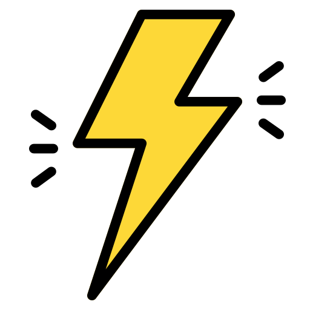

---

  <b>English</b> · <a href="docs/README.es.md">Español</a> · <a href="docs/README.zh-CN.md">中文</a> · <a href="docs/README.ru.md">Русский</a>

### Flash

### A private, ad-free habit & task tracker with advanced analytics

Log a habit in a single tap, track recurring tasks, and watch your productivity grow.

 

> **🙏 Full Attribution & Upstream Credit**  
> **Flash** is an open-source productivity app built on top of [Streak](https://github.com/InlitX/streak), originally designed and crafted with care by [@InlitX](https://github.com/InlitX).  
> All core habit-tracking engines, focus timers, local encrypted storage, and foundational design systems are courtesy of InlitX and the Streak contributors.  
> If you find this software helpful, please consider **[starring the upstream repository](https://github.com/InlitX/streak)** and **[supporting InlitX on Ko-fi](https://ko-fi.com/inlitx)**!

 

  
  
  
  
  

 

  <a href="#flash-features">Flash Features</a> ·
  <a href="#upstream-habit-tracking">Habit Tracking</a> ·
  <a href="#focus">Focus Timer</a> ·
  <a href="#privacy">Privacy</a> ·
  <a href="#upstream-sync">Upstream Sync</a> ·
  <a href="#license">License</a>

---

## ⚡ Features Added in Flash

On top of the comprehensive habit tracker and focus timer from Streak v2.0.0, Flash introduces:

### 1. 🔁 Advanced To-Do Recurrence Engine
- **Flexible Repeat Frequencies**: Set tasks to repeat `Daily`, `Weekdays` (auto-skips weekends), `Weekly`, `Monthly`, or at `Custom` day intervals.
- **Completion History**: Completing a recurring task logs the completion date into `completedDates` and advances to the next due date without destroying task context.
- **Historical View**: Recurring tasks appear in the Completed tab with completion date records and recurrence badges.

### 2. 📝 To-Do Notes System
- **Rich Context Anywhere**: View and edit multi-line notes, agendas, and deliverables at any task lifecycle stage (pending, active, recurring, or completed).
- **Instant Bottom Sheet**: Accessible via tap on any task tile or preview card.

### 3. ⏱️ Duration Estimation & Day Planning
- **Time Block Presets**: Quick-select `15m`, `30m`, `45m`, `60m`, `90m`, `120m` or custom duration.
- **Schedule Sync**: Displays duration pills on task tiles and feeds into the Day Timeline schedule.

### 4. 📊 Dedicated To-Do Statistics Dashboard
- **Habits | Tasks Top Switcher**: Seamless scope switcher on the Statistics tab across both Classic and Express styles.
- **2x2 Headline Metrics**: Completed tasks this year, completed this week, on-time completion rate (%), and velocity (average completions per active day).
- **Charts & Distributions**:
  - *Weekday Distribution*: Bar chart highlighting completions from Monday through Sunday.
  - *Monthly Trend Line*: Annual completion curve across all 12 months.
  - *Priority Breakdown*: Ranked horizontal progress bars color-coded by priority.
  - *Project Breakdown*: Donut chart and ranked project list with percentage distribution.
  - *Project Filtering*: Quick filter chips to view metrics for "All Projects" or specific folders.

### 5. 🎯 Streamlined UX & Ergonomics
- **Unified Completed Tasks**: Unified completed task management into a clean `[Pending]` / `[Completed]` segmented toggle, removing redundant sheets and collapsible menus.
- **View Mode Retention**: User choice between Folder View and Detailed List View persists permanently across app restarts and process kills.
- **Enlarged Bottom Navigation**: Refactored tab bar height, touch targets, and typography for comfortable one-handed use.
- **Unified FAB Design**: Aligned the Habits screen Floating Action Button styling, geometry, and elevation with the To-Do screen FAB.
- **Simplified App Styles**: Streamlined options to polished **Classic** and **Express** styles, cleanly removing the unused Minimal style.
- **Launcher Stability**: Fully removed Android `<activity-alias>` tags, preventing home screen icon disappearance and startup crashes on Android 12–15.

---

## Overview

Flash (built on Streak) is an open source habit and task tracker for Android, Windows and Linux. Make as
many habits and tasks as you want, log them with one tap, and watch the grid, the streak
counters and the statistics fill up.

Everything stays on your device. No account, no ads, nothing to sync.

<b>Today</b> · <b>Focus</b> · <b>Statistics</b> · <b>Insights</b> · <b>Amounts</b> · <b>Notes</b> · <b>Personalize</b> · <b>Free &amp; private</b>

---

## Overview

Streak is an open source habit tracker for Android, Windows and Linux. Make as
many habits as you want, log them with one tap, and watch the grid, the streak
counters and the statistics fill up.

Everything stays on your device. No account, no ads, nothing to sync.

---

## Features

<table>
<tr>
<td width="50%" valign="top">

### Tracking

- One-tap logging from the home screen, a widget or the notification
- Three kinds of habit: **normal**, **avoid** (with relapses) and **amount**,
  with your unit and daily goal
- **Checklists** split a habit into steps, done when all are checked
- **Flexible schedules**: daily, X times a week or month, chosen weekdays, or
  every N days
- **Fill in the past**: tap any day to add or remove it
- **Day notes**: long-press a day to write what happened, or attach a photo
- **Vacation mode** pauses a habit without breaking anything

</td>
<td width="50%" valign="top">

### Seeing your progress

- GitHub-style **activity grid**, by week, month or the whole year
- **Month calendar**, with your week starting on Monday, Saturday or Sunday
- **Completions per month**, so you can see the shape of a whole year
- **Streak evolution** charted over time, watching the line climb
- **"When are you most consistent?"** finds the hours you actually show up
- Totals, best and current streak, completion rate and a per-habit
  **strength** score
- A **shareable progress card** in several sizes, exported as a polished image

</td>
</tr>
<tr>
<td width="50%" valign="top">

### Focus sessions

- A timer for the habits that need one, free or tied to a habit and its goal
- **Pomodoro rounds** with short breaks, or one long stretch
- Three clock styles: **Circle**, **Flip** and **Dots**
- Built-in sounds (rain, brown noise, warm pad) or your own tracks, in order
  or shuffled
- Calm scenes as a background, or a photo of your own
- Tick off subtasks without leaving the timer, and keep the screen awake
- A **daily focus goal**, plus a history of every session you finish

</td>
<td width="50%" valign="top">

### Making it yours

- **Classic, Minimal or Express**: three complete designs, each with its own
  typography, shapes and motion
- Minimalist icon pack, or any emoji you like
- Custom accent color with a full picker
- Light and dark themes, plus five app backgrounds: solid, gradient, dots,
  true-black OLED or a photo of your own
- Cover photos, categories, drag-to-reorder, profile name and photo
- Three launcher icons, so Streak matches the rest of your home screen
- A burst of confetti the day you finish everything

</td>
</tr>
<tr>
<td width="50%" valign="top">

### Reminders and widgets

- Reminders per habit, on the days you choose or every N days, each with a
  short encouraging line
- **Done**, **Snooze** and **Add amount** buttons right in the notification
- **Four home-screen widgets**: habit, today, stats and activity grid
- Each widget styled on its own, with color or photo, opacity and border
- Choose which figures the **stats widget** shows, and how they sit together
- Tick a day straight from a widget, it saves without opening the app
- Tap the activity grid to jump into that habit

</td>
<td width="50%" valign="top">

### Your data

- **Import** from Loop Habit Tracker, HabitKit, Habitica and HabitBull,
  history and streaks included, or any CSV with a habit and a date
- Backup and restore with a single file you keep yourself
- **Automatic backups**, daily or weekly, to a folder of your choosing
- **App lock** with a PIN or your fingerprint, for phones without one
- **Archive** habits without losing a day of their history
- Everything is offline: no account, no server, nothing to sync
- Seven languages, with more open on Weblate

</td>
</tr>
</table>

---

## Coming from another app?

<b>How the import works</b>

Bring your history with you. Streak reads exports from **Loop Habit Tracker**,
**HabitKit**, **Habitica** and **HabitBull**, so your past days and your streaks
survive the move. Any other CSV works too, as long as it has a habit and a date.

<b>Settings → Data → Import from another app</b>

---

## Download

[**F-Droid**](https://f-droid.org/packages/com.streak.app/) is the easiest way:
it installs Streak and keeps it updated for you. It's also on
[**IzzyOnDroid**](https://apt.izzysoft.de/fdroid/index/apk/com.streak.app?repo=main)
and [**OpenAPK**](https://www.openapk.net/streak/com.streak.app/).

Streak runs on Android, Windows and Linux:

| Platform | Status |
|----------|--------|
| Android | ✅ Supported |
| Windows | ✅ Supported |
| Linux | ✅ Supported |
| iOS | 🚧 In progress |
| macOS | 📅 Planned |

<b>Linux</b>

Two files on the [**Releases**](https://github.com/InlitX/streak/releases) page,
both for 64-bit x86:

| File | For |
|------|-----|
| `Streak-x86_64.AppImage` | Any distribution: make it executable and run it |
| `Streak-linux-x64.tar.gz` | Unpack anywhere and run `Streak` |

The Linux build has only just landed, so expect some rough edges. Reminders ring
while Streak is open. If something does not work, open an issue and I will fix
them as they come.

<b>Install the APK yourself</b>

Prefer the raw APK? It's on the
[**Releases**](https://github.com/InlitX/streak/releases) page, one file per
phone type so each download stays small:

| APK | For |
|-----|-----|
| `Streak-arm64-v8a.apk` | Modern 64-bit phones, **pick this one** |
| `Streak-armeabi-v7a.apk` | Older 32-bit devices |
| `Streak-x86_64.apk` | Emulators and x86 tablets |

Runs on **Android 9 (Pie) and newer**.

If you install the APK yourself, [**Obtainium**](https://github.com/ImranR98/Obtainium)
keeps it updated: add `https://github.com/InlitX/streak` and it will follow the
Releases page, tell you when a new version is out and pick the right APK for
your phone.

> [!NOTE]
>Streak isn't on the Play Store. Since the APK doesn't come from a store,
>Android may ask you to allow installs from your browser or file manager the
>first time.

---

## Privacy

> [!IMPORTANT]
>Streak has **no analytics, no advertising SDK and no network backend**. The
>app never sends your data anywhere; it stays on your device. The only
>outbound actions are links you choose to open yourself.

---

## Translations

Streak speaks **English, Spanish, French, Portuguese, Russian, Ukrainian and
Chinese** in full, with **German, Polish, Hebrew, Indonesian and Persian** on
their way, and more languages are very welcome.
Translations are managed on [**Weblate**](https://hosted.weblate.org/engage/streak/):
no coding needed, just short phrases you translate in your browser.

How it works → [**TRANSLATING.md**](TRANSLATING.md)

---

## Contributing

Bug reports, ideas and pull requests are all welcome, see
[**CONTRIBUTING.md**](CONTRIBUTING.md). For anything larger than a fix, open an
issue first so we can agree on the direction.

---

## Inspiration

<b>The apps that shaped Streak</b>

These are the apps Streak learned from:

- **[Loop Habit Tracker](https://github.com/iSoron/uhabits)**, for proving a
  habit tracker can be free, offline and still excellent.
- **[Grit](https://github.com/shub39/Grit)**, for the small motions that make a
  list feel alive.
- **[HabitKit](https://www.habitkit.app/)**, for how good a year of history
  looks as a coloured grid.
- **[Habitica](https://github.com/habitRPG/habitica)**, for treating showing up
  as something worth celebrating.

The island you build in the gamification tab is drawn with
**[Mykonos Island Voxels](https://github.com/boona13/mykonos-island-voxels)** by
boona13, an MIT licensed set of isometric voxel art. Thank you for putting it
out there for anyone to use.

---

## Support

Streak is free, open source and free of ads, and it stays that way.

If you want to give something back, a star, a translation or a clear bug report
help as much as a coffee does.

<b>Crypto wallets</b>

<table align="center">
  <tr>
    <td align="center" width="130"> <b>Bitcoin</b></td>
    <td><code>bc1qm0r4pg8nknnjh3a7n2t63ckafhsz8jdd6qer29</code></td>
  </tr>
  <tr>
    <td align="center" width="130"> <b>Ethereum</b></td>
    <td><code>0x34b7A5552132cBca150Ae29c1E632faA49430e1a</code></td>
  </tr>
  <tr>
    <td align="center" width="130"> <b>Solana</b></td>
    <td><code>DC8dNEUNJhWdtBHBZAn4FTheVC3W4PtkGhbazvtk17Jo</code></td>
  </tr>
  <tr>
    <td align="center" width="130"> <b>Monero</b></td>
    <td><code>44SECMEf3rfV228kpy3Gs48wLmLXnq231gAMG7ULYoCWBWLYLHdwYV7YFkhMk31DR5P7SRAyRPyhkYaehtgEoajASz7qubq</code></td>
  </tr>
</table>

 
 

<a href="https://www.star-history.com/?repos=InlitX%2Fstreak&type=date&legend=top-left">
 <picture>
   <source media="(prefers-color-scheme: dark)" srcset="https://api.star-history.com/chart?repos=InlitX/streak&type=date&theme=dark&legend=top-left&sealed_token=aNqDTOocHK1NkSrMsZrD1iFDpo1AtZvvUo3ZqETCzSujh-eSh0ekwpay4FpVGocizt1wmR5QWrkuMUAl2r9yllwF4v9e3tnsI6c1lv0upumuFVgsXGvAwA" />
   <source media="(prefers-color-scheme: light)" srcset="https://api.star-history.com/chart?repos=InlitX/streak&type=date&legend=top-left&sealed_token=aNqDTOocHK1NkSrMsZrD1iFDpo1AtZvvUo3ZqETCzSujh-eSh0ekwpay4FpVGocizt1wmR5QWrkuMUAl2r9yllwF4v9e3tnsI6c1lv0upumuFVgsXGvAwA" />
   
 </picture>
</a>

 
 

Released under the <a href="LICENSE"><b>GNU GPLv3</b></a>.

